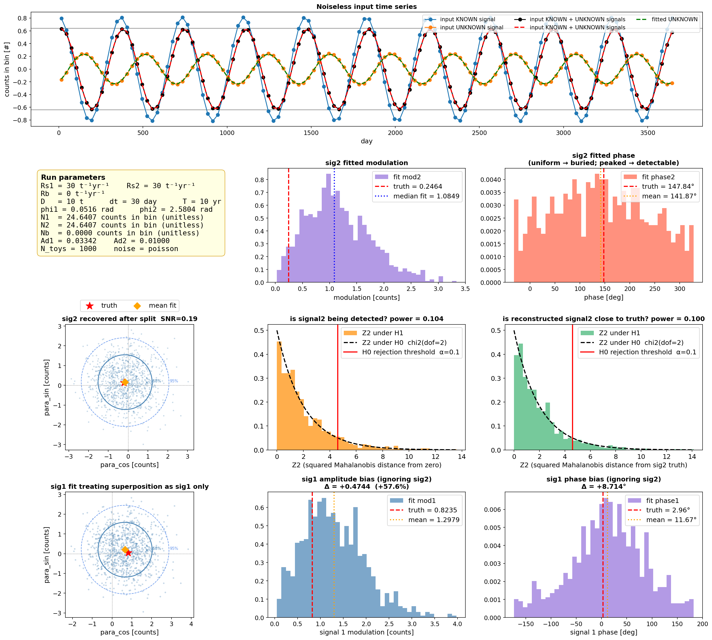
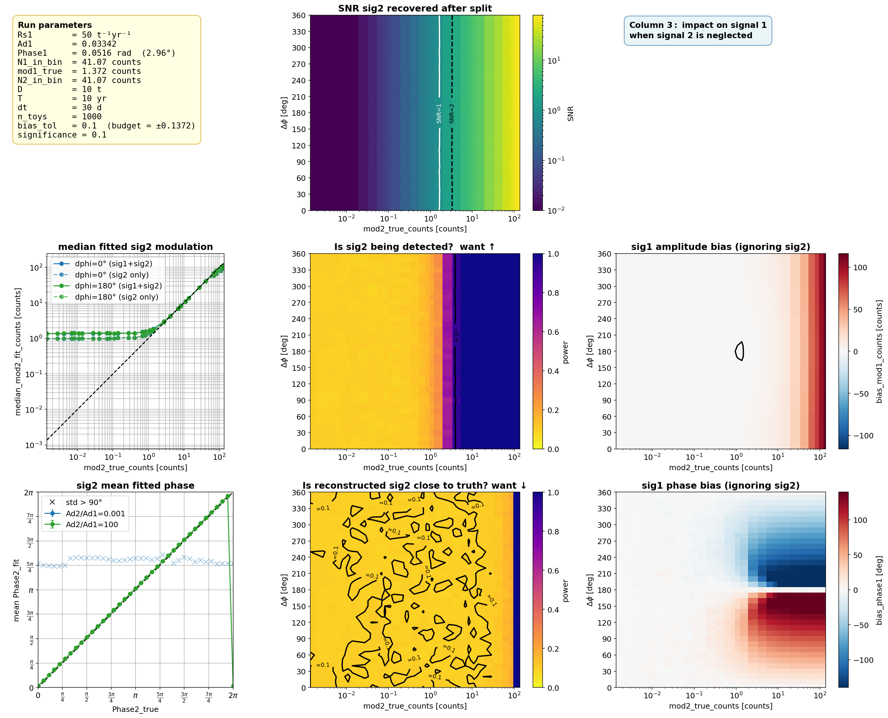
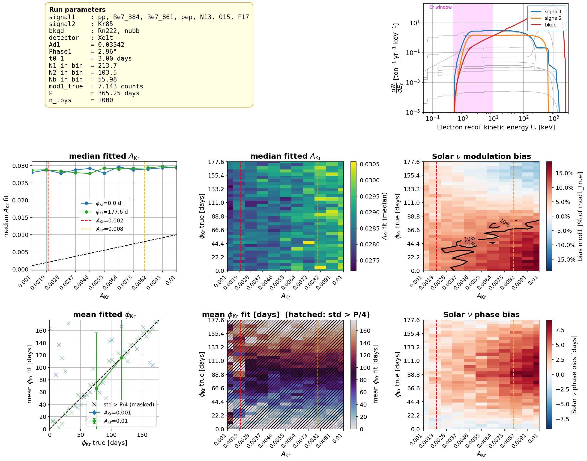
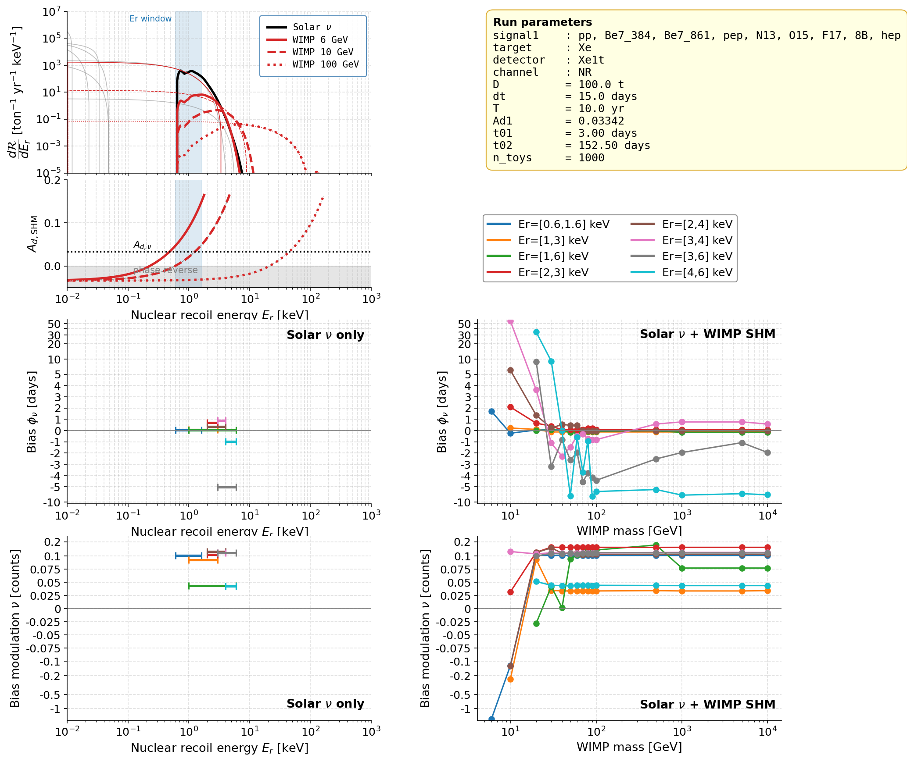

# phasor_decomp
General analysis of periodic signals (1yr) sharing the same frequency but differing in amplitude and phase, with application to potential annual modulation analysis in Xenon experiments. (mentioned in [6.2.3](https://oaktrust.library.tamu.edu/items/e405a6b7-c1ec-4c33-89f4-2a4fc823e1e4))

- **Solar neutrino**: due to earth orbiting, measured amplitude and phase
- **WIMP**:  annual modulation, due to earth orbiting, unknown, model dependent, standard halo model and upperlimit of xsec
- **Kr85**: background in Xenon electron recoil, measured decay rate has ~ 1y, detail unknown, amplitude phase are ancient. Source: periodic decay rate source:
[Ambient humidity, the overlooked influencer of radioactivity measurements](https://iopscience.iop.org/article/10.1088/1681-7575/ad0c9f),
[Analysis of Beta-Decay Rates for Ag108, Ba133, Eu152, Eu154, Kr85, Ra226 And Sr90, Measured at the Physikalisch-Technische Bundesanstalt from 1990 to 1996](https://arxiv.org/abs/1408.3090),
[Half-life measurements of long-lived radionuclides—New data analysis and systematic effects](https://www.sciencedirect.com/science/article/abs/pii/S0969804309007222)


## 4 Questions

- **Q1:** Can signal 2 be extracted out?
- **Q2:** How can a neglected signal 2 contaminate the understanding of signal 1?
- **Q3:** With signal 1 known, how accurately can signal 2 be extracted — and what properties of signal 2 enable accurate extraction?
- **Q4:** How is signal 2 reconstruction affected by Poisson noise alone, in the absence of signal 1?

## Procedure


use T=10 yr, P = 365.25 days 
**Signal model:**

```
N_in_bin = R * dt ×* D       [counts]
mod      = Ad * N_in_bin    [counts]
```

**Single-run case:** Select `R1`, `R2`, `Ad2`.



**Scanned case:** Select `R1`; scan a range of `mod2`, where `mod2 = Ad2 × N2_in_bin`. Use `Ad2 / Ad1` to control `mod2`, with `N2_in_bin = N1_in_bin`.



## Modulation Count

choose an Er window

**WIMP SHM modulation counts:**

$$\int_{E_{\min}}^{E_{\max}} A_d(E_r)\*\frac{dN(E_r)}{dE_r}\ dE_r \times D \times dt$$

**Kr and Solar $\nu$ modulation counts:**

$$A_d \int_{E_{\min}}^{E_{\max}} \frac{dN(E_r)}{dE_r}\ dE_r \times D \times dt$$

## Applications

**Electron recoil channel** — Kr and Solar $\nu$:


**Nuclear recoil channel** — Solar $^8$B $\nu$ and WIMP SHM:



---

## Repository structure

```
phasor_decomp/
│
├── figures/                              ← output plots
├── sim_data/                             ← simulation output data
│
│   # core decomposition
├── decomp_calc.py                        ← phasor decomposition math
├── run_decomp.py                         ← entry point for decomposition
├── toy_runner.py                         ← toy MC runner
├── convert_params.py                     ← parameter conversion utilities
│
│   # spectrum inputs
├── get_realistic_spectrum.py             ← realistic signal spectrum (smear + efficiency)
├── get_sumraw_spectrum.py                ← raw summed spectrum
├── get_wimp_Erwindow.py                  ← WIMP energy window selection
│
│   # single-case toy runner
├── sim_toyrunner_singlecase.py           ← simulate single case
├── plot_toyrunner_singlecase.py          ← plot single case results
│
│   # scanned toy runner
├── sim_scanned_toyrunners.py             ← simulate scanned cases
├── plot_scanned_toyrunner.py             ← plot scanned results
│
│   # application: electron recoil (Solar ν + Kr85)
├── sim_scanned_toyrunner_Solar-Kr.py     ← simulate Solar ν vs Kr scan
├── plot_scanned_toyrunner_Solar-Kr.py    ← plot Solar ν vs Kr results
│
│   # application: nuclear recoil (Solar 8B .... ν + WIMP)
├── sim_scanned_toyrunner_Solar-WIMP.py   ← simulate Solar ν vs WIMP scan
└── plot_scanned_toyrunner_Solar-WIMP.py  ← plot Solar ν vs WIMP results
```

---

## Related repositories

This repository expects the following sibling directories:

```
~/projects/
├── neutrino_spectrum/      ← https://github.com/YZHUANGwork/neutrino_spectrum 
├── wimp_spectrum/          ← https://github.com/YZHUANGwork/wimp_spectrum
└── detector_efficiency/    ← https://github.com/YZHUANGwork/detector_efficiency
└── phasor-decomp/          ← this repo
```

current issue: for larger dt~30 days, signal 1 only, noiseless, bias can be non trivial. 
